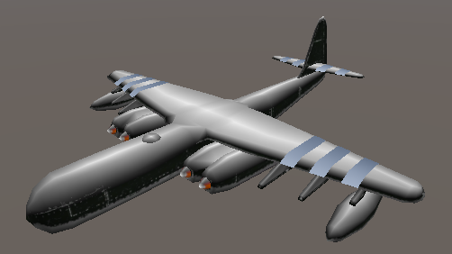

# Triplanar Mapping

A collection of a few simple triplanar mapping shaders.

# Contains

		Triplanar Additive - Instead of blending colors, only render the one corresponding to the strongest normal axis

		Triplanar Blend - Blend the 3 colors based on the value of the normalized axis.

		Triplanar Textures - Triplanar Additive but with textures

		Triplanar Snow - One texture / One snow color. Snow is rendered where Y is strongest. Texture everywhere else. 

		Hexaplanar - Different colors for negative axis and positive axis

# Example

## Triplanar Snow

# Consider buying me a coffee if you like my work (click the image)

